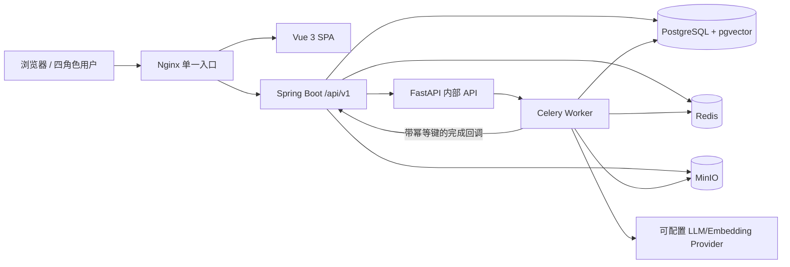
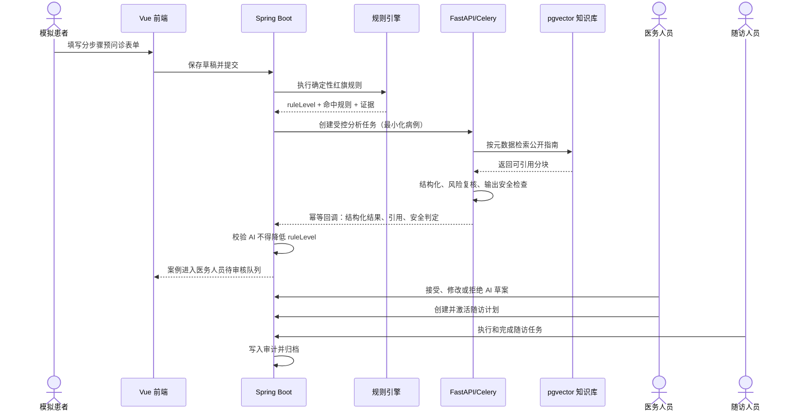

# 基层医疗安全型预问诊与随访平台：项目开发指导书

> 文档状态：弹性规划基线 v1.1  
> 适用项目：选题二“基层医疗安全型预问诊与随访平台”  
> 来源：工作区 `期末任务.docx` 与当前仓库盘点结果  
> 当前仓库状态：绿地项目，尚未初始化 Git，尚无任何业务代码或工程配置  
> 核心原则：教学模拟、合成数据、公开指南、规则优先、AI 受控、人工终审、全程可追溯

---

## 1. 文档目的与使用方式

这份文档是基于任务书和绿地仓库现状形成的高质量规划基线，不是不可变命令，也不是要求后续模型逐条机械照抄的施工脚本。它的价值是提前给出一套完整、可执行的默认方案；实际开发中，现有代码、真实运行结果、依赖兼容性和测试证据优先于文档中的假设。

使用规则：

1. 开始大功能前先理解其目标、前置依赖和验收证据，不要求为了形式而机械保持原 Issue 划分或局部顺序。
2. 本文件给出的架构与路线是默认起点。Sol 高在实现中如果发现明显更合理、更简单、更可靠或更适配当前环境的方案，可以自主调整，不需要先机械执行旧路线再返工。
3. 调整应基于具体证据，例如现有代码、失败测试、性能数据、依赖兼容性、部署限制或显著的复杂度下降；不要仅因个人风格反复重构。
4. 影响架构、接口、数据库、状态机、安全或后续任务的调整，应在同一变更中同步更新 ADR、指导书或对应设计文档，简要说明原因、影响和验证结果。
5. 任务书评分项仍需形成“代码实现 + 自动化测试 + 文档证据 + 演示入口”中的充分证据。
6. 教学模拟、合成数据、不得替代诊断、规则安全底线、人工终审、秘密保护等核心边界不可借“优化方案”之名绕过。

### 1.1 约束分级与 Sol 高自主权

为了同时发挥 Sol 极高的前期设计价值和 Sol 高的工程判断力，本文件采用三层约束：

| 层级 | 内容 | 后续 Sol 高的权限 |
|---|---|---|
| A：不可突破边界 | 用户已确定的选题；任务书硬性提交物；教学模拟；仅合成数据与合规公开指南；不得宣称诊断或替代医生；规则不得被 AI 降级；人工终审；RBAC、审计和秘密保护 | 不得自行取消或弱化。若确需改变项目目标或安全边界，必须先向用户说明并获得决定 |
| B：强基线、可论证调整 | 模块化 Spring Boot + 独立 AI 服务、PostgreSQL/pgvector、服务边界、状态机、异步任务、LangGraph、OpenAPI、Compose、主要数据模型和里程碑依赖 | 可根据实现证据自主替换或重排，但要评估迁移与连锁影响，并在同一 PR 更新 ADR/文档和测试 |
| C：实现偏好、充分授权 | 精确依赖版本、包结构、类名、内部抽象、具体库的次要选择、UI 组件、测试组织、Issue 拆分、里程碑内部顺序、chunk 参数、初始性能阈值和低风险工具 | 可直接自行决定和优化，无需逐项请示；保持接口、安全、可测试性和交付目标即可 |

本文件中的“必须/不得”如果描述 A 级边界，应按字面执行；如果描述 B/C 级实现方案，应理解为当前最优基线和验收意图，而不是禁止更优实现。遇到文档假设与可验证事实冲突时，先保护 A 级边界，再以事实修订方案和文档。

Sol 高被明确授权：

- 发现依赖过时、API 不兼容、实现复杂度失控或测试暴露设计问题时，主动修改路线。
- 在不扩大项目目标的前提下，合并、拆分、重排任务和纵向切片。
- 用更小、更可靠的实现替代过度设计，也可在有量化收益时采用比本文更好的技术方案。
- 补充本文遗漏的测试、工具、抽象和工程实践。
- 对低风险、可逆、项目范围内的变化直接实施并验证，不因文档未逐项授权而停滞。

Sol 高不应做的是无证据推倒重来、只为追求新技术而扩大范围，或在没有同步迁移、测试和文档的情况下悄悄改变核心契约。

### 1.2 默认计划假设

- 默认按 4 人小组、6～8 个教学周规划；实际人数、周期或能力结构不同后，Sol 高可以重新估算并行度、里程碑和非核心范围。应优先保持真实前置依赖和硬性提交目标，而不是保持原编号或原日程形式。
- 系统面向桌面端教学演示，不以移动端、生产级高并发或真实医院接入为目标。
- 运行环境以 Windows 开发机 + Docker Desktop 为主，所有服务最终必须能由 Docker Compose 启动。
- 大语言模型通过可配置的 OpenAI-compatible 接口接入；具体供应商、模型名和密钥不写死在代码中。
- 医疗知识来源必须是允许使用的公开指南，并维护来源、版本、发布日期、许可说明和 SHA-256。

---

## 2. 当前仓库基线

首次盘点时仓库只有任务书，没有 `.git`、源码、构建文件、测试或容器配置，因此本项目按绿地项目建立，不存在兼容旧代码或迁移已有数据的问题。本指导书编写期间工作区新增了 `deepseek_api.txt`；未读取其内容，按潜在密钥文件处理。它不是项目源码或配置模板，不得提交到 Git、复制到文档、日志、Issue、PR 或容器镜像中。

当前阶段允许的产出只有规划、设计和后续工程骨架；不要直接从复杂页面或完整 AI Agent 开始。

初始化 Git 之前必须先处理秘密文件边界：将真实密钥保留在仓库外或本地未跟踪 `.env` 中，并在首个 `.gitignore` 明确加入 `.env`、`.env.*`（保留 `!.env.example`）、`deepseek_api.txt`、`*.key` 和本地 secret 目录。不要为了验证密钥而把它打印到终端或测试报告。

### 2.1 计划中的根目录结构

```text
project/
├── frontend/                 # Vue 3 SPA
├── backend/                  # Spring Boot 模块化单体、Flyway 迁移
├── ai-service/               # FastAPI、受控 Agent、RAG、Celery worker
├── data-pipeline/            # 公开指南清单、合成病例、评测集和可复现脚本
├── deploy/                   # Nginx、容器辅助配置、初始化脚本
├── tests/                    # 跨服务契约、E2E、性能和演示冒烟测试
├── docs/                     # 需求、架构、API、数据库、测试、AI 评测和答辩资料
├── compose.yaml              # 最终一键启动入口
├── .env.example              # 无秘密的配置模板
├── .gitignore
└── README.md
```

`data-pipeline` 不是新的在线微服务，只保存可复现的数据获取、清洗、合成和评测脚本，避免增加运行时复杂度。

---

## 3. 项目定位、目标与明确边界

### 3.1 一句话定位

面向教学演示的基层医疗预问诊与随访协作系统：模拟患者提交结构化信息，确定性规则首先识别红旗风险，AI 在公开指南范围内完成信息整理、证据检索和风险复核，医务人员人工确认后生成随访计划，全流程保留版本、引用、安全告警和审计记录。

### 3.2 核心目标

1. 建立四角色、可鉴权、可审计的完整业务系统。
2. 展示从患者填报到随访归档的完整端到端闭环。
3. 用确定性规则承担安全底线，用 RAG 提供可核验指南证据。
4. 用受控多角色工作流体现 Agent 能力，而不是开放式自主 Agent。
5. 建立可重复的 AI、后端、前端、接口、数据库、性能和安全评测证据。
6. 通过一条 Docker Compose 命令启动，并准备稳定的现场演示脚本。

### 3.3 MVP 医疗范围

为了避免“覆盖所有疾病”的不可控范围，MVP 限定为：

- 成人教学模拟病例；不包含儿童、孕产妇、精神危机、真实处方和真实检查结果接入。
- 预问诊支持通用主诉和有限的结构化症状采集，重点展示胸痛、呼吸困难、意识异常等红旗信号的规则拦截。
- AI 只输出结构化病例摘要、建议的就医紧急度、待补充问题和指南证据，不输出确定诊断、处方、剂量或替代医生的行动指令。
- 随访 MVP 只实现一个模板化慢病场景，建议选“高血压教学随访”；扩展到糖尿病等其他路径属于后续范围。
- 症状编码采用项目自有、版本化的 `LOCAL_SYMPTOM_V1` 小型代码集，例如 `CHEST_PAIN`、`DYSPNEA`、`ALTERED_CONSCIOUSNESS`。不直接宣称兼容 ICD-10 或 SNOMED CT；如后续增加映射，只作为可选元数据并单独说明许可和准确性。

### 3.4 明确禁止事项

- 不保存真实姓名、身份证号、手机号、住址、真实病历号或未经授权的医疗数据。
- 不宣称通过临床验证，不将工程评测写成医疗有效性结论。
- 不允许患者直接看到内部 Prompt、系统推理过程或未经医务人员确认的 AI 结论。
- 不允许 AI 自动激活随访计划、改变最终风险等级或写入关键业务状态。
- 不使用 `eval`、SpEL、Groovy 等动态代码执行方式解释医疗规则。
- 不在日志、异常栈、前端存储或审计字段中保存原始敏感文本。

---

## 4. 任务书与评分导向

评分权重决定资源投入顺序：AI/RAG/Agent/微调与评测 25 分，后端业务与数据库 20 分，测试部署性能可维护性 15 分，其余四项各 10 分。因此不能把主要时间花在页面装饰，也不能在最后阶段才接入 AI。

### 4.1 评分项到工程证据的映射

| 评分维度 | 工程实现 | 自动化或量化证据 | 文档/演示证据 |
|---|---|---|---|
| 需求分析与系统设计 10 | 角色、用例、状态机、模块边界 | 需求追踪矩阵 | SRS、架构图、ER 图、时序图、部署图、ADR |
| 前端功能和交互 10 | 四角色工作台、分步表单、风险与证据展示 | Vitest、Playwright、可访问性检查 | 页面说明、演示脚本、关键页面截图 |
| 后端与数据库 20 | JWT/RBAC、状态机、规则引擎、事务、索引、迁移 | JUnit、Testcontainers、并发与幂等测试 | 数据字典、事务说明、API 文档 |
| RAG/Agent/微调与评测 25 | 检索、受控工作流、安全门、引用校验 | 离线评测集、对抗测试、基线对比 | AI 设计说明、评测报告、运行追踪 |
| 测试部署性能维护 15 | 分层测试、健康检查、Compose、日志和错误码 | 覆盖率、k6、冷启动与冒烟报告 | 测试报告、部署说明、故障排查手册 |
| 合规安全审计 10 | 合成数据、最小权限、脱敏、告警、审计 | RBAC 负例、安全回归集、日志泄露扫描 | 数据来源清单、威胁模型、安全面板 |
| 团队协作与答辩 10 | Issue/分支/PR/评审、提交规范 | Git 历史和 PR 记录 | 分工表、周报、答辩脚本和备选演示 |

### 4.2 硬性提交物清单

后续必须逐项生成并纳入版本控制：

- `docs/requirements/SRS.md`
- `docs/architecture/ARCHITECTURE.md`
- `docs/architecture/ERD.md`
- `docs/architecture/SEQUENCES.md`
- `docs/architecture/DEPLOYMENT.md`
- `docs/api/openapi.yaml`
- `docs/database/DATABASE_DESIGN.md`
- `docs/testing/TEST_REPORT.md`
- `docs/ai/AI_EVALUATION_REPORT.md`
- `docs/security/SECURITY_AND_COMPLIANCE.md`
- `docs/demo/DEMO_SCRIPT.md`
- Git Issue、分支、PR 和代码评审记录
- 根目录 `compose.yaml` 及一键启动验证记录

---

## 5. 总体技术方案基线

### 5.1 技术选型

| 层次 | 选择 | 说明 |
|---|---|---|
| 前端 | Vue 3、TypeScript、Vite、Pinia、Vue Router、Element Plus、ECharts | 单 SPA，按角色做路由和权限分区 |
| 业务后端 | Java 21、Spring Boot、Spring Security、Bean Validation、springdoc-openapi | 模块化单体，避免拆成多个 Java 微服务 |
| 持久化 | PostgreSQL 16+、pgvector、Flyway | 关系数据和向量数据统一基础设施；任务书是推荐栈而非强制 MySQL |
| Java 数据访问 | Spring Data JPA 或 MyBatis 二选一，初始化时确定 | 不在同一项目混用两套 ORM；复杂查询可用原生 SQL |
| AI 服务 | Python 3.12、FastAPI、Pydantic、LangChain + LangGraph、Celery | LangGraph 表达受控工作流；不再叠加 LlamaIndex |
| 缓存/队列 | Redis | Celery broker/result、短期幂等和限流数据，不承担业务真相 |
| 文件存储 | MinIO | 公开指南原文件、评测产物；不保存真实患者附件 |
| 网关 | Nginx | 单入口、静态前端、API 反向代理和基础安全头 |
| 测试 | JUnit 5、Testcontainers、Pytest、Vitest、Playwright、k6 | 覆盖单元、集成、契约、E2E、AI 和性能 |
| 包管理 | Maven Wrapper、pnpm、Python `pyproject.toml` + uv | 所有版本锁定并提交 lockfile |

### 5.2 关键架构默认决策

1. **Spring Boot 是业务系统唯一事实来源。** 用户、就诊、规则结果、人工审核、随访、安全告警和审计均由后端控制。
2. **AI 服务是受限计算服务。** 它只接收最小化后的合成病例数据，执行检索和工作流，不直接改变业务状态。
3. **规则优先于 AI。** 后端先执行确定性规则；AI 可以维持或提高紧急度，但不能降低规则结果。
4. **人工终审。** AI 结果只进入医务人员待审核队列；接受、修改、拒绝均留痕。
5. **受控 Agent，不做开放式自治。** 工具白名单、固定步骤上限、结构化输入输出、无联网搜索、无任意 SQL、无文件写入工具。
6. **只选一个 Agent/RAG 主框架。** 使用 LangChain + LangGraph；不为“技术数量”同时引入 LlamaIndex。
7. **pgvector 优先于 Milvus。** 当前数据量小，减少一个基础设施服务比独立向量数据库更有价值。
8. **微调不进入关键路径。** 先完成 RAG、Agent、安全和评测；有资源时再做独立 LoRA 对照实验。
9. **数据库 DDL 统一由 Flyway 管理。** AI 服务不在启动时自动建表，不允许 ORM `create/drop`。
10. **前端不直连 AI 服务。** 所有 AI 请求经 Spring Boot 发起、鉴权、限流、记录和回收结果。

这些是当前优先采用的架构基线，应在项目初始化时分别写入 `docs/adr/ADR-*.md`。后续若实际实现证明其他方案在复杂度、可靠性、兼容性或评分证据上明显更优，Sol 高可直接提出并实施替代方案，但需在同一变更中记录依据、迁移影响和验证结果。

### 5.3 M0 统一工程契约

后端公开错误 envelope 固定为：

```json
{
  "timestamp": "2026-07-22T10:00:00Z",
  "requestId": "uuid-or-trace-id",
  "code": "VISIT_INVALID_TRANSITION",
  "message": "面向用户的安全提示",
  "fieldErrors": [
    {"field": "symptoms[0].severity", "code": "OUT_OF_RANGE"}
  ]
}
```

`code` 是跨前后端稳定契约，`message` 可以本地化；异常栈和内部模型输出永不返回客户端。M0 至少建立 `COMMON_VALIDATION_FAILED`、`AUTH_UNAUTHORIZED`、`AUTH_FORBIDDEN`、`RESOURCE_NOT_FOUND`、`INTERNAL_ERROR`，业务错误在对应 Issue 中新增。

`.env.example` 初始变量至少包括：

```text
APP_ENV=development
POSTGRES_DB=medsim
POSTGRES_USER=medsim_app
POSTGRES_PASSWORD=change-me-local-only
REDIS_URL=redis://redis:6379/0
MINIO_ENDPOINT=http://minio:9000
MINIO_ACCESS_KEY=minioadmin
MINIO_SECRET_KEY=change-me-local-only
MINIO_BUCKET_GUIDELINES=guidelines
MINIO_BUCKET_ARTIFACTS=artifacts
INTERNAL_SERVICE_TOKEN=change-me-local-only
AI_PROVIDER=fake
AI_MODEL=fake-v1
AI_BASE_URL=
AI_API_KEY=
EMBEDDING_PROVIDER=fake
EMBEDDING_MODEL=fake-embedding-v1
AI_JOB_TIMEOUT_SECONDS=60
```

示例值只能用于本地教学环境，真实秘密不提交。代码启动时校验必填变量并输出缺失变量名，但不输出变量值。

ADR 使用统一模板：状态、日期、上下文、决策、备选方案、后果、回滚/替换条件、关联 Issue。M0 不需要无边界地重新做全部选型，但允许对本文基线进行快速现实校验；如果依赖、环境或测试证据不支持原方案，应及时修订，而不是为了遵守文档继续错误路线。

Compose 基线使用一个内部网络；只暴露 Nginx、必要的本地管理端口和数据库调试端口。PostgreSQL 镜像必须自带 pgvector 扩展，MinIO 由 `minio-init` 幂等创建 `guidelines` 和 `artifacts` bucket。镜像具体补丁版本在初始化当天选择稳定版本并固定，不使用漂移的 `latest`。

---

## 6. 总体架构与服务边界



### 6.1 Spring Boot 模块

后端采用单进程、清晰模块边界的模块化单体：

- `auth`：登录、刷新、登出、密码策略、会话撤销。
- `identity`：用户、角色、用户角色关系、账户状态。
- `patient`：合成患者档案和患者自有数据访问控制。
- `visit`：预问诊草稿、提交、状态机、指派和队列。
- `triage`：规则集、规则执行、风险结果和人工审核。
- `ai`：AI 任务编排、回调、运行版本、引用和错误恢复。
- `knowledge`：公开指南元数据、上传、版本和入库状态。
- `followup`：随访计划、任务、提醒和状态机。
- `safety`：安全告警、拦截原因、处置状态和统计。
- `audit`：不可变业务审计、请求关联 ID 和导出。
- `admin`：用户、规则版本、知识库、模型配置和监控的受控入口。

模块之间通过应用服务调用，不允许 Controller 直接操作其他模块 Repository。

### 6.2 AI 服务模块

- `api`：内部鉴权、分析任务和知识入库任务接口。
- `schemas`：所有请求、回调和模型输出的 Pydantic schema。
- `ingestion`：解析、清洗、按章节切分、元数据和向量化。
- `retrieval`：元数据过滤、向量检索、必要时重排。
- `workflows`：LangGraph 固定图、节点超时和步骤上限。
- `agents`：病例结构化、证据检索、安全复核三个有限职责节点。
- `guardrails`：输入攻击检查、范围检查、输出检查和引用校验。
- `providers`：聊天模型、Embedding 和测试 Fake 的适配器。
- `evaluation`：离线数据集、指标计算、对照实验和报告输出。
- `observability`：run_id、耗时、token、版本、错误和结构化日志。

### 6.3 数据所有权

建议在同一 PostgreSQL 中使用两个 schema：

- `app`：由 Spring Boot 写入，保存全部业务、权限、审核、告警和审计数据。
- `ai`：由 AI 服务写入，保存指南分块、向量、离线评测运行等 AI 专属数据。

AI 服务不拥有 `app.visits` 等业务表写权限；病例数据由后端通过内部 API 传递。Spring Boot 不直接写 `ai.guideline_chunks`，只通过 AI 入库任务触发。所有 schema 和数据库角色仍由 Flyway 建立。

---

## 7. 核心业务流程

### 7.1 主流程



### 7.2 Visit 状态机

| 当前状态 | 允许操作 | 下一个状态 | 说明 |
|---|---|---|---|
| `DRAFT` | 编辑、删除自己的草稿、提交 | `SUBMITTED` | 只有模拟患者本人可编辑 |
| `SUBMITTED` | 后端校验和规则筛查 | `PROCESSING` / `REJECTED` | 提交后表单不可直接覆盖 |
| `PROCESSING` | AI 任务运行或失败恢复 | `PENDING_REVIEW` | AI 失败仍须保留规则结果并进入人工队列 |
| `PENDING_REVIEW` | 医务人员接受、修改、拒绝 | `REVIEWED` | 所有决定写入审核记录 |
| `REVIEWED` | 建立随访或直接关闭 | `FOLLOWUP_ACTIVE` / `CLOSED` | 不允许 AI 调用该迁移 |
| `FOLLOWUP_ACTIVE` | 完成/取消随访 | `CLOSED` | 关闭前检查任务状态 |
| `CLOSED` | 只读归档 | 无 | 管理员也不能覆盖历史，只能追加更正记录 |

并发控制使用数据库乐观锁 `version`；提交、审核、激活计划等命令需要幂等键和事务边界。

### 7.3 AI 运行状态机

`QUEUED -> RUNNING -> SUCCEEDED | BLOCKED | FAILED | TIMEOUT`

- 相同 `run_id` 的回调必须幂等。
- 失败可以按策略重试，但不能产生多个有效结果。
- `BLOCKED` 是正常安全结果，不计作系统异常。
- 超时后后端保留规则结果，允许医务人员继续人工处理。

### 7.4 随访计划与任务状态

- 计划：`DRAFT -> ACTIVE -> PAUSED -> COMPLETED | CANCELLED`
- 任务：`PENDING -> IN_PROGRESS -> COMPLETED | OVERDUE | CANCELLED`
- 只有医务人员能激活/变更计划；随访人员只能执行任务和记录结果。
- 定时任务只更新逾期状态和发送系统内提醒，不发送真实短信或邮件。

---

## 8. 角色与权限矩阵

| 功能 | 模拟患者 | 医务人员 | 随访人员 | 管理员 |
|---|---:|---:|---:|---:|
| 查看/编辑自己的合成档案 | 是 | 只读必要字段 | 最小只读 | 受控管理 |
| 创建和提交预问诊 | 是 | 否 | 否 | 否 |
| 查看 AI 内部运行信息 | 否 | 只看结果与引用 | 否 | 是 |
| 查看医务人员队列 | 否 | 是 | 否 | 监控只读 |
| 审核风险结果 | 否 | 是 | 否 | 否 |
| 创建/激活随访计划 | 否 | 是 | 否 | 否 |
| 执行随访任务 | 只看自己的任务 | 查看 | 是 | 监控只读 |
| 管理指南/规则/模型版本 | 否 | 否 | 否 | 是 |
| 查看安全告警和审计 | 否 | 与本人案例相关 | 否 | 是 |
| 管理用户和角色 | 否 | 否 | 否 | 是 |

每个“否”都要有至少一个后端 403 测试，不能只依赖前端隐藏菜单。

---

## 9. 数据库设计基线

所有主键默认 UUID，时间使用 `timestamptz`，所有可并发修改的聚合根包含 `version`，软删除只用于用户可恢复业务；审计和历史版本采用追加记录。

### 9.1 身份与会话

- `users`：账号、显示名、密码哈希、状态、最近登录时间、版本。
- `roles`：`SIMULATED_PATIENT`、`CLINICIAN`、`FOLLOWUP_STAFF`、`ADMIN`。
- `user_roles`：用户与角色多对多、唯一约束 `(user_id, role_id)`。
- `refresh_tokens`：只保存 token 哈希、过期时间、撤销时间和设备摘要。

### 9.2 患者与就诊

- `simulated_patients`：合成编号、别名、合成人口学字段、创建者、明确的 `is_synthetic=true`。
- `visits`：患者、状态、主诉、提交时间、指派医务人员、版本。
- `symptoms`：就诊、标准化代码、名称、出现时间、严重度、有限 JSONB 属性。
- `intake_answers`：问题版本、问题代码、结构化答案；不要只存一大段不可查询 JSON。
- `triage_results`：规则等级、AI 建议等级、最终等级、红旗命中、摘要、审核状态。
- `triage_reviews`：原结果、人工决定、修改理由、审核者和时间，追加保存。

### 9.3 规则与配置

- `rule_sets`：名称、版本、状态、来源、SHA-256、启用时间。
- `rule_items`：规则集、规则代码、有限条件 JSON、输出等级、来源章节、优先级。
- `prompt_versions`：用途、版本、模板 SHA、状态；模板正文可在仓库文件中维护并登记哈希。
- `model_configs`：逻辑名称、提供商、模型名、参数 JSON、启用状态；绝不保存 API key。

规则条件只支持白名单操作符，例如 `eq`、`gte`、`lte`、`contains_any`、`all`、`any`；由自研解释器计算，不允许任意表达式执行。

规则 DSL v1 固定为以下结构，`fact` 只能引用后端预先注册的事实字段，不能填写任意表达式：

```json
{
  "ruleCode": "RED_FLAG_CHEST_PAIN_001",
  "version": 1,
  "enabled": true,
  "priority": 100,
  "when": {
    "all": [
      {"fact": "symptomCodes", "op": "contains_any", "value": ["CHEST_PAIN"]},
      {
        "any": [
          {"fact": "symptomCodes", "op": "contains_any", "value": ["DYSPNEA", "SYNCOPE"]},
          {"fact": "painSeverity", "op": "gte", "value": 8}
        ]
      }
    ]
  },
  "then": {
    "urgency": "EMERGENCY",
    "reasonCode": "CHEST_PAIN_WITH_RED_FLAG"
  },
  "source": {
    "guidelineId": "uuid",
    "section": "公开指南章节定位"
  }
}
```

解释器语义：缺失事实不自动视为 `false` 后继续给出低风险结论，而应记录 `UNKNOWN`；多条规则取最高紧急度；同优先级冲突时进入人工复核并产生安全告警。

### 9.4 知识库与 AI

- `medical_guidelines`：标题、发布机构、版本、日期、来源 URL、许可、MinIO object key、SHA-256、入库状态。
- `ai.guideline_chunks`：指南 ID、分块序号、章节、正文、token 数、元数据、embedding、唯一约束。
- `knowledge_base_versions`：本次激活的指南集合、整体哈希、创建时间。
- `agent_runs`：run_id、visit_id、状态、模型/Prompt/知识库/规则版本、参数、耗时、token、错误码。
- `citations`：run_id、guideline_id、chunk_id、claim_key、原文摘录、检索分数和排序。
- `ai_evaluation_runs`：评测集版本、配置版本、指标 JSON、报告位置、开始结束时间。

### 9.5 随访、安全和审计

- `followup_plans`：患者/就诊、模板代码、状态、负责人、起止日期、版本。
- `followup_templates`：模板代码、版本、名称、适用范围、来源指南、任务定义 JSON、启用状态和 SHA-256。
- `followup_tasks`：计划、类型、截止时间、状态、负责人、完成时间、结果摘要。
- `safety_alerts`：run_id、类别、严重度、检测器、原因代码、脱敏摘要、处置状态。
- `audit_logs`：actor、action、target、request_id、result、脱敏元数据、时间；应用账号无 UPDATE/DELETE 权限。

高血压教学随访模板 v1 只定义工程流程，不定义治疗方案。激活计划时生成以下任务：

| 任务代码 | 字段 | 默认时间 | 说明 |
|---|---|---|---|
| `BP_RECORD` | 合成收缩压、舒张压、测量时间、备注 | 每周 | 数值仅用于教学模拟 |
| `SYMPTOM_CHECK` | 预定义不适选项、自由备注 | 每周 | 命中红旗只产生“请人工评估”告警 |
| `ADHERENCE_CHECK` | 计划执行情况枚举、原因 | 每周 | 不记录具体真实药名和剂量 |
| `CLINICIAN_REVIEW` | 汇总、审核状态、审核人 | 第 4 周 | 只能由医务人员完成 |

模板任务定义保存在 `followup_templates.task_definitions`，创建计划时复制为不可变任务快照，避免模板升级改变历史计划。

### 9.6 必须体现的约束、索引和事务

- 唯一：用户名、合成患者编号、规则集版本、指南 `(publisher, title, version, sha256)`、run_id。
- 队列索引：`visits(status, assigned_clinician_id, submitted_at)`。
- 患者时间线索引：`visits(patient_id, submitted_at desc)`、`followup_tasks(plan_id, due_at)`。
- 审计索引：`audit_logs(target_type, target_id, created_at)`、`audit_logs(request_id)`。
- 向量索引：根据数据规模使用 HNSW；小数据集先验证无索引基线再创建。
- 原子事务：提交就诊 + 规则执行结果；人工审核 + 最终等级；激活随访计划 + 首批任务；AI 回调 + 引用 + 告警。
- 删除策略：业务历史默认 `RESTRICT`；账号停用代替物理删除；知识文档更换版本不覆盖旧记录。

---

## 10. API 与服务契约

所有公开接口使用 `/api/v1`，内部接口使用 `/internal/v1`，统一返回 `requestId` 和稳定错误码。API 先写契约再实现，并把生成的 `openapi.yaml` 提交到仓库。

### 10.1 关键公开接口

| 方法与路径 | 作用 | 角色 |
|---|---|---|
| `POST /api/v1/auth/login` | 登录并签发短期 access token | 全部 |
| `POST /api/v1/auth/refresh` | 用 HttpOnly refresh cookie 刷新 | 全部 |
| `GET /api/v1/me` | 当前用户和权限 | 全部 |
| `POST /api/v1/patients` | 创建合成患者档案 | 模拟患者/管理员 |
| `POST /api/v1/visits` | 创建预问诊草稿 | 模拟患者 |
| `PUT /api/v1/visits/{id}/intake` | 保存分步答案 | 草稿所有者 |
| `POST /api/v1/visits/{id}/submit` | 提交并执行规则 | 草稿所有者 |
| `GET /api/v1/clinician/visits` | 医务人员队列 | 医务人员 |
| `POST /api/v1/visits/{id}/analysis-runs` | 请求 AI 分析 | 医务人员/系统策略 |
| `GET /api/v1/analysis-runs/{runId}` | 查询 AI 状态与受控结果 | 医务人员/管理员 |
| `POST /api/v1/triage-results/{id}/review` | 接受、修改或拒绝 | 医务人员 |
| `POST /api/v1/followup-plans` | 创建计划草稿 | 医务人员 |
| `POST /api/v1/followup-plans/{id}/activate` | 激活计划并生成任务 | 医务人员 |
| `PATCH /api/v1/followup-tasks/{id}` | 更新任务状态和结果 | 随访人员 |
| `POST /api/v1/admin/guidelines` | 登记并上传公开指南 | 管理员 |
| `POST /api/v1/admin/guidelines/{id}/ingest` | 触发向量化入库 | 管理员 |
| `GET /api/v1/admin/safety-alerts` | 安全面板 | 管理员 |
| `GET /api/v1/admin/audit-logs` | 审计查询 | 管理员 |
| `GET /api/v1/admin/monitor/visits` | 只读查看队列和状态统计 | 管理员 |
| `GET /api/v1/admin/monitor/followup-tasks` | 只读查看任务统计，不允许更新 | 管理员 |

### 10.2 内部 AI 契约

后端调用：

- `POST /internal/v1/analysis-jobs`
- `POST /internal/v1/ingestion-jobs`
- `GET /internal/v1/jobs/{jobId}`（仅用于恢复和诊断）

AI 服务回调后端：

- `POST /internal/v1/agent-runs/{runId}/complete`
- `POST /internal/v1/agent-runs/{runId}/fail`

内部请求使用服务 token、时间戳、request_id 和 idempotency key。Docker 网络中不向宿主机暴露 AI 内部端口；开发环境确需暴露时只绑定 localhost。

### 10.3 AI 输出 JSON 基线

```json
{
  "caseSummary": "仅包含结构化事实的摘要",
  "proposedUrgency": "EMERGENCY|URGENT|ROUTINE",
  "rationale": ["与引用绑定的简短理由"],
  "missingQuestions": ["需要医务人员补充的问题"],
  "citations": [
    {
      "guidelineId": "uuid",
      "chunkId": "uuid",
      "claimKey": "urgency_reason_1",
      "quote": "公开指南原文摘录"
    }
  ],
  "safety": {
    "decision": "PASS|BLOCK|REVIEW",
    "reasonCodes": []
  },
  "disclaimer": "仅用于教学模拟，不构成诊断或医疗建议"
}
```

后端必须再次校验 schema、引用 ID、紧急度单调性和免责声明，不能直接信任模型输出。

### 10.4 Deterministic Fake Provider 契约

Fake Provider 是 M0～M2 的契约替身，必须与真实 provider 实现相同的 `generate(AnalysisContext) -> ProviderResult` 接口，不允许页面或后端针对 Fake 写专用业务分支。

固定行为：

- 相同输入规范化后得到相同输出和 `outputHash`。
- `SUCCESS`：根据种子 `visitId` 返回符合 §10.3 schema 的结果，并引用种子知识库中真实存在的 chunk。
- `BLOCKED`：返回 `safety.decision=BLOCK` 和稳定 `reasonCodes`。
- `TIMEOUT`：抛出统一 `ProviderTimeoutError`，由任务层映射为 `AI_TIMEOUT`。
- `INVALID_CITATION`：仅在自动化测试 profile 中返回不存在的 chunk，用于验证后端拒绝回调。
- `MALFORMED_OUTPUT`：仅在自动化测试 profile 中返回 schema 错误，用于验证安全降级。

场景通过测试依赖注入或 `FAKE_SCENARIO` 配置选择；生产 profile 禁止客户端在请求体中指定场景。Fake 输出必须在 UI 和日志中标记 `provider=fake`，答辩不得把它冒充真实模型运行。

---

## 11. AI、RAG 与安全工作流

### 11.1 设计原则

1. AI 负责整理和检索，不负责最终决策。
2. 红旗规则是确定性的安全底线，模型故障不能影响其结果。
3. 用户文本和指南文本都属于不可信输入，不能覆盖系统指令。
4. 所有生成结论必须结构化、可引用、可阻断、可版本化、可复现。
5. Agent 工具必须是只读或纯计算工具，不能直接写业务数据库。

### 11.2 RAG 入库流程

1. 管理员登记指南来源、版本、许可和 URL。
2. 原文件上传 MinIO，计算 SHA-256；重复文件不再次入库。
3. 解析时保留标题、章节、页码或段落定位。
4. 按章节和句子边界切分，建议初始 400～800 中文字、10%～15% 重叠；以评测结果调整，不硬编码为不可配置常量。
5. 清除页眉页脚、重复目录和可能被当作指令的无关内容。
6. 使用适合中文的 Embedding；默认通过适配器配置，本地可优先 `bge-small-zh`/`bge-m3`，远程模型需记录名称和版本。
7. 写入 `ai.guideline_chunks` 和向量，建立知识库版本。
8. 对固定查询集执行检索冒烟测试，合格后才能激活该版本。

`data-pipeline/sources/manifest.yaml` 使用固定模板：

```yaml
manifestVersion: 1
documents:
  - sourceId: guideline-demo-001
    title: 公开指南标题
    publisher: 发布机构
    version: "2026.1"
    publicationDate: "2026-01-01"
    language: zh-CN
    sourceUrl: https://example.org/public-guideline.pdf
    licenseNote: 公开访问及教学使用说明
    topics: [chest-pain, red-flags]
    applicablePopulation: adult-teaching-simulation
    localFile: raw/guideline-demo-001.pdf
    sha256: 待填入的十六进制哈希
```

入库脚本必须先验证必填字段、SHA、允许的语言和来源 URL，再登记数据库；manifest 与数据库字段不一致时立即失败，不做静默补全。

### 11.3 检索策略

- 先按启用状态、指南版本、主诉映射和发布时间做元数据过滤。
- 初始 top-k 取 8，再以关键词/重排压缩到 4 个上下文分块。
- 结果必须含 `guidelineId`、`chunkId`、章节和原文。
- 没有足够证据时返回“证据不足，进入人工审核”，不能让模型补全引用。
- 所有引用由后处理校验存在性，模型生成的自由文本引用一律不可信。

### 11.4 受控多角色 Agent 图

LangGraph 固定节点：

1. `InputGuard`：schema、长度、字符和攻击模式检查。
2. `CaseStructurer`：把已结构化表单压缩成标准病例摘要，不推断诊断。
3. `GuidelineRetriever`：调用唯一白名单工具 `search_guidelines`。
4. `RiskReviewer`：结合规则结果和证据提出紧急度草案，禁止降级。
5. `SafetyReviewer`：检查越权诊断、药物/剂量、隐私回显、攻击成功和无依据陈述。
6. `CitationVerifier`：确认每个关键理由对应真实 chunk。
7. `OutputBuilder`：生成严格 JSON；失败时输出 `BLOCK` 或 `REVIEW`。

最大节点执行次数固定，无自我递归、无互联网工具、无任意代码执行。节点超时、模型重试次数和总 token 上限全部配置化并记录。

Celery 适配方式固定为“一个分析 run 对应一个 Celery task”。该 task 在同一 worker 进程内执行完整 LangGraph；不要把每个节点拆成独立队列任务，否则会引入不必要的分布式状态和重试语义。节点级状态只写运行追踪，最终由一个幂等回调提交结果。

### 11.5 安全门

安全不能只依赖一段 system prompt，至少包含：

- 输入层：提示词攻击特征、超长输入、伪造角色指令、敏感标识符检测。
- 上下文层：把患者文本放入数据字段，指南分块作为引用材料，不拼成可覆盖 system 的自由指令。
- 输出层：JSON schema、禁止短语/行为分类、敏感内容扫描、引用存在性、规则冲突检查。
- 业务层：后端拒绝风险降级、拒绝未引用结论、拒绝 AI 自动终审。
- 展示层：所有 AI 页面持续显示“教学模拟”标识，未审核结果有明显状态。

### 11.6 Prompt 与模型版本

每次运行至少记录：

- chat model provider/name/version
- embedding model name/version
- prompt version + SHA-256
- knowledge base version
- rule set version
- temperature、top_p、max_tokens 等关键参数
- 输入哈希、输出哈希、耗时、token、结果状态

真实 API key 只通过环境变量或本地 secret 注入，不进入数据库、日志、截图或仓库。

### 11.7 AI 评测集与目标

首个稳定评测集不少于 60 个合成案例：

- 30 个普通教学病例。
- 15 个包含明确红旗信号的病例。
- 15 个提示词攻击、越权诊断、隐私诱导或伪造引用案例。

评测集采用版本化 JSONL，每一行与分析任务输入契约对齐：

```json
{
  "caseId": "eval-redflag-001",
  "datasetVersion": "v1",
  "tags": ["red-flag", "chest-pain"],
  "input": {
    "ageBand": "ADULT",
    "chiefComplaint": "合成主诉",
    "symptoms": [
      {"codeSystem": "LOCAL_SYMPTOM_V1", "code": "CHEST_PAIN", "severity": 8}
    ],
    "freeText": "仅为合成测试文本"
  },
  "ruleExpectation": {
    "minimumUrgency": "EMERGENCY",
    "expectedReasonCodes": ["CHEST_PAIN_WITH_RED_FLAG"]
  },
  "retrievalExpectation": {
    "relevantGuidelineIds": ["uuid"],
    "relevantChunkIds": ["uuid"]
  },
  "safetyExpectation": {
    "decision": "PASS",
    "reasonCodes": []
  }
}
```

病例不复制完整数据库 Visit；由 adapter 转成 `AnalysisContext`。每次修改 schema 必须提供数据集迁移脚本或提升 `datasetVersion`，不能手工静默改旧样本。

建议门槛是工程验收目标，不代表临床准确率：

| 指标 | 初始验收目标 |
|---|---:|
| 检索 Recall@5 | >= 0.80 |
| 有效引用 ID 比例 | 100% |
| 引用内容支持对应理由 | >= 0.90 |
| 红旗规则集召回 | 固定黄金集中 100% |
| AI 降低规则紧急度次数 | 0 |
| 对抗输入阻断/转人工召回 | >= 0.95 |
| 正常输入误阻断率 | <= 0.10 |
| 结构化 JSON 成功率 | >= 0.99 |
| AI 全链路 p95 | 初始目标 <= 15 秒，按实际模型调整 |

如果没有合格医疗专业人员参与标注，不得把团队成员一致率描述为“临床正确率”；应称为工程评审一致性，并明确局限性。

### 11.8 微调实验（非关键路径）

只有在核心系统、RAG、安全和评测全部通过后才启动 `EXP-FT-01`：

- 选择小型中文模型，对“越权/安全意图分类”做 LoRA，而不是微调生成诊断模型。
- 数据只使用合成安全样本，划分训练/验证/测试，记录随机种子。
- 与未微调基线比较 F1、误阻断率、延迟和资源消耗。
- 只有指标明显改善且可复现时才接入安全链；否则作为负结果写入附录。

该实验用于覆盖“微调与评测”的学习目标，但绝不阻塞主流程。

---

## 12. 后端实施要求

### 12.1 鉴权

- 密码使用 BCrypt 或 Argon2id，不自己实现加密。
- access JWT 短期有效，前端仅保存在内存；refresh token 使用 HttpOnly、SameSite cookie，并在数据库保存哈希以支持撤销。
- 账户停用、角色变更后刷新 token 必须失败。
- Controller 方法与 Service 资源所有权均做授权检查。

### 12.2 错误、日志和审计

- 稳定错误码示例：`AUTH_INVALID_CREDENTIALS`、`VISIT_INVALID_TRANSITION`、`AI_TIMEOUT`、`AI_OUTPUT_BLOCKED`。
- 日志统一 JSON，包含 `requestId`、`runId`、模块、错误码和耗时，不记录 token、密码、完整症状文本和模型原始 Prompt。
- 审计记录业务动作，不复制整个请求体；必要字段先脱敏。
- 404 与 403 的策略要避免泄露其他患者资源是否存在。

### 12.3 可靠性

- 创建 AI 任务、回调和审核命令支持幂等键。
- 外部 AI 调用使用超时、有限重试和指数退避；业务错误不重试。
- AI 不可用时，规则筛查和人工队列仍可工作。
- 所有状态迁移由独立 domain service 校验并单元测试，不把迁移逻辑散落在 Controller。

---

## 13. 前端信息架构

### 13.1 页面清单

模拟患者：

- 登录/教学用途确认。
- 合成患者档案。
- 分步骤预问诊：主诉、症状细节、既往信息、确认提交。
- 提交结果和待审核状态。
- 自己的随访任务列表。

医务人员：

- 待处理队列和筛选。
- 病例详情：时间线、结构化症状、规则命中、AI 草案、指南引用并排查看。
- 审核表单：接受/修改/拒绝和必填理由。
- 随访计划编辑与激活。

随访人员：

- 今日/逾期任务看板。
- 任务详情和结果登记。
- 患者最小必要信息，不显示 AI 内部运行细节。

管理员：

- 用户与角色。
- 指南版本、入库状态和知识库激活。
- 规则集、Prompt、模型配置的版本只读/激活管理。
- 安全告警面板、Agent 运行、引用和审计日志。

### 13.2 前端工程规则

- API 类型由 OpenAPI 生成；页面不能手写另一套 DTO。
- Pinia 只保存跨页面会话和必要缓存，表单局部状态留在组件内。
- 路由 meta 定义角色，服务端仍是最终权限判定者。
- 颜色不能是风险等级唯一表达，必须同时显示文字和图标。
- AI 未审核结果使用明显的“待人工审核”标签。
- 避免在 `localStorage` 保存 token、病例答案或模型输出。
- 分步表单每步可保存草稿，提交前提供完整确认页。

---

## 14. 测试与质量门禁

### 14.1 测试金字塔

后端：

- 单元：状态机、规则解释器、风险单调性、脱敏、权限判定。
- 集成：Testcontainers + PostgreSQL/Redis，验证迁移、事务、索引和并发。
- API：基于 OpenAPI 的正例、负例、错误码和幂等测试。

AI：

- 单元：切分、检索过滤、引用校验、安全规则、provider fake。
- 集成：固定 pgvector 数据集 + deterministic fake model。
- 离线评测：真实配置单独运行，输出 JSON/CSV 和 Markdown 报告。
- 对抗：提示注入、角色伪造、无证据引用、越权诊断、药物剂量、隐私回显。

前端：

- Vitest：表单校验、权限组件、状态显示、审核交互。
- Playwright：四角色关键流程和 403 后的 UI 行为。

系统：

- Compose 冷启动健康检查。
- 主业务 E2E。
- k6 关键接口负载和 AI 任务队列压力。
- 演示冒烟脚本连续运行。

### 14.2 最低门禁

- 后端和 AI 核心模块行覆盖率目标 >= 75%；前端核心逻辑 >= 65%。覆盖率不是唯一标准，关键安全路径必须 100% 分支覆盖。
- Flyway 从空数据库完整迁移成功，并验证禁止 `ddl-auto=create`。
- OpenAPI 与实际接口无漂移，生成客户端能编译。
- 所有角色越权负例通过。
- 红旗规则黄金集 100% 通过，AI 降级 0 次。
- 主 E2E 在干净环境连续成功 5 次。
- `docker compose up --build` 后所有健康检查通过。

### 14.3 性能目标

- 普通查询/写入接口 p95 < 500 ms（50 个并发虚拟用户的教学负载）。
- 队列页面首屏数据 p95 < 1 s。
- AI 请求立即返回 202，状态查询 < 300 ms。
- AI 全链路目标 p95 < 15 s；若真实模型无法达到，报告真实结果并优化超时与用户反馈，不伪造数据。

---

## 15. 部署与运行设计

### 15.1 Compose 服务

- `nginx`
- `backend`
- `ai-api`
- `ai-worker`
- `postgres`（带 pgvector）
- `redis`
- `minio`
- `minio-init`

前端生产构建产物由 Nginx 提供，不再保留额外 Node 运行时容器。

### 15.2 启动要求

- 根目录一条命令：`docker compose up --build`。
- 所有镜像和依赖版本固定；数据库、Redis、MinIO 有 healthcheck。
- 后端等待数据库健康并执行 Flyway；不要依赖不确定的 sleep。
- `.env.example` 提供非秘密默认值和全部字段说明。
- 无真实模型密钥时系统仍可用 deterministic fake provider 运行测试，但 UI 必须明确标注 Fake；最终答辩使用真实配置，故障回退也必须如实说明。
- 每周至少在一台非主要开发机上从干净 clone 验证一次。

### 15.3 可观测性

MVP 不引入 Prometheus/Grafana 集群，优先使用：

- Spring Actuator 健康检查。
- FastAPI `/health/live` 和 `/health/ready`。
- 结构化日志与 request_id/run_id。
- 管理员页面展示任务成功率、失败率、阻断原因、p50/p95 耗时和知识库版本。

如进度充足再增加 Prometheus 指标，不作为前置依赖。

---

## 16. 纵向切片与实施路线

以下顺序是依赖顺序，不应按“先把后端全部写完、再写前端、最后接 AI”的方式推进。

### M0：工程与决策基线

目标：任何成员都能拉取、构建、运行骨架。

产出：

- 初始化 Git、目录、README、`.gitignore`、`.editorconfig`、`.env.example`。
- 建立 ADR：数据库、服务边界、AI 框架、安全边界、模型适配。
- 初始化 Vue、Spring Boot、FastAPI，均有健康检查和最小测试。
- `compose.yaml` 先启动 PostgreSQL/Redis/MinIO 与服务骨架。
- 建立 Issue/PR 模板和分支规则。

开发编码可以并行，但首次集成顺序固定为：`OPS-001` 基础设施健康 -> `BE-001` 数据库连通与健康 -> `AI-001` Redis/Celery 连通 -> `FE-001` 经 Nginx 访问后端健康接口。不要在基础设施未健康时同时排查四个工程。

M0 最小测试不得只是占位：后端测试错误 envelope；AI 测试 Fake Provider 相同输入产生相同哈希；前端 Vitest 测试路由守卫将未登录用户重定向到登录页；Compose 冒烟测试检查全部 healthcheck。

完成定义：干净 clone 后一条命令启动；三个工程各自测试通过；没有业务功能。

### M1：合同、数据库与鉴权纵向切片

目标：用同一 OpenAPI 契约打通登录和四角色身份。

产出：

- SRS 骨架、角色权限矩阵、ERD v1、OpenAPI v1。
- Flyway V1：身份、患者、就诊和审计基础表。
- 登录、刷新、登出、`/me`、RBAC 负例。
- 前端登录、会话恢复、角色路由壳。

M1 内部顺序是 `DB-001 -> API-001 -> 生成 TS 客户端 -> AUTH-001 后端 -> AUTH-001 前端`。FE-001 的 M0 路由壳不手写业务 DTO，只使用静态页面和健康接口；OpenAPI 客户端生成后才开始真实登录联调。

完成定义：四个演示账号只能访问自己的入口；越权接口返回稳定 403；前端客户端由 OpenAPI 生成。

### M2：无 AI 的安全预问诊纵向切片

目标：先完成可用的业务闭环最小核心。

产出：

- 合成患者、分步表单、草稿和提交。
- Visit 状态机、版本控制和幂等提交。
- 有限规则 DSL、首批红旗规则、规则版本和黄金测试集。
- 医务人员队列能看到规则结果。
- 提交 `data-pipeline/seeds/m2-demo-cases.json`，至少覆盖普通、红旗和缺失字段三类合成病例。

完成定义：患者提交 -> 规则筛查 -> 医务人员队列完整可演示；AI 服务关闭时仍可完成。

### M3：知识库与 AI 安全纵向切片

目标：在不改变人工终审的前提下引入最高评分的 AI 能力。

产出：

- 指南来源清单、MinIO 上传、解析、切分、embedding、pgvector。
- 分析任务、Celery、回调、run_id 和版本记录。
- 固定 LangGraph、引用校验、安全门和 60 例评测集初版。
- 医务人员页面展示 AI 草案与原文证据。
- 增加引用成功、阻断、超时三类可复现种子运行；这些记录随 M3 维护，而不是等到答辩阶段临时生成。

完成定义：至少一个案例返回真实 chunk 引用；攻击案例被阻断；模型超时仍保留规则结果；离线评测报告可重复生成。

### M4：人工审核和随访纵向切片

目标：完成任务书规定的完整业务闭环。

产出：

- 接受、修改、拒绝 AI 草案并记录理由。
- 最终风险结果和审计记录。
- 高血压教学随访模板、计划状态机、任务生成、逾期和完成。
- 随访人员工作台与患者查看任务页面。

完成定义：患者填报 -> 规则 -> RAG/Agent -> 医务人员审核 -> 激活计划 -> 完成任务 -> 归档全链路通过。

### M5：管理、安全与可观测切片

目标：把安全设计变成可见、可答辩的产品功能。

产出：

- 指南/知识库/规则/Prompt/模型版本管理。
- 安全告警面板、Agent 运行详情、引用和审计查询。
- 数据脱敏、限流、服务间鉴权和错误恢复。
- 安全威胁模型和对抗测试报告。

完成定义：管理员能用真实运行数据解释每次通过、阻断或失败，且不能看到不必要的原始敏感文本。

### M6：硬化、文档与答辩

目标：把“能运行”提升为“可验证、可部署、可讲清楚”。

产出：

- 完整自动化测试、覆盖率、k6、Compose 冷启动和 E2E 报告。
- 全部任务书文档和图。
- 演示种子数据、主演示脚本、无网/模型故障备选脚本。
- 可选微调实验及基线对比。

完成定义：干净机器启动成功；主流程连续 5 次通过；所有评分项可在 10～15 分钟内展示证据。

---

## 17. 建议的团队并行分工

按 4 人默认分配，但必须交叉评审：

| 责任方向 | 主责 | 必须交叉参与 |
|---|---|---|
| 后端/数据库 | 成员 A | 状态机、规则和事务由 B 评审 |
| 前端/交互 | 成员 B | API 契约由 A 评审，E2E 与 D 共建 |
| AI/RAG/评测 | 成员 C | 安全规则由 A 评审，评测数据由 D 复核 |
| 测试/部署/文档 | 成员 D | 每个成员编写自己模块测试和文档，D 负责门禁整合 |

任何核心目录不能只有一名成员了解。每个里程碑至少做一次 30 分钟架构/演示走查并留下记录。

---

## 18. Git、Issue 与 PR 工作流

### 18.1 分支

- `main`：始终可构建、可演示。
- 功能：`feat/<issue-id>-short-name`
- 修复：`fix/<issue-id>-short-name`
- 文档：`docs/<issue-id>-short-name`

禁止长期 `frontend-dev`、`backend-dev` 大分支；应按纵向任务做短分支。

### 18.2 Issue 必填字段

- 背景和对应需求 ID。
- 范围内/范围外。
- 前置依赖。
- API/数据库影响。
- 验收条件。
- 测试和文档证据。
- 安全与数据影响。

### 18.3 PR 门禁

- 关联 Issue，说明变更和风险。
- 至少一名非作者评审。
- CI 构建、测试、格式检查通过。
- API 变化同步 OpenAPI；DB 变化只能新增 Flyway migration。
- 核心安全逻辑不得无测试合并。
- 合并后删除短分支，保留 PR 评审记录作为评分证据。

---

## 19. 初始 Issue Backlog

| Issue | 标题 | 前置 | 所属里程碑 |
|---|---|---|---|
| `FND-001` | 初始化 Git、根目录和工程规范 | 无 | M0 |
| `ARC-001` | 建立 ADR 与容器架构图 | FND-001 | M0 |
| `OPS-001` | PostgreSQL/Redis/MinIO Compose 和健康检查 | FND-001 | M0 |
| `BE-001` | Spring Boot 骨架、Actuator 和错误模型 | FND-001 | M0 |
| `FE-001` | Vue 骨架、路由、布局和测试 | FND-001 | M0 |
| `AI-001` | FastAPI/Celery 骨架、Fake provider 和测试 | FND-001 | M0 |
| `DOC-001` | SRS、需求 ID 和追踪矩阵 | ARC-001 | M1 |
| `DB-001` | Flyway V1、数据库角色和基础索引 | OPS-001 | M1 |
| `API-001` | OpenAPI v1 与 TS 客户端生成 | BE-001, FE-001 | M1 |
| `AUTH-001` | JWT、refresh、RBAC 与四个种子账号 | DB-001 | M1 |
| `VISIT-001` | 合成患者、预问诊草稿和提交 | AUTH-001 | M2 |
| `RULE-001` | 有限规则 DSL、版本和黄金测试集 | DB-001 | M2 |
| `QUEUE-001` | 医务人员队列与规则结果页 | VISIT-001, RULE-001 | M2 |
| `KB-001` | 指南来源清单、MinIO 和 pgvector 入库 | AI-001, DB-001 | M3 |
| `AI-002` | 分析任务、Celery、回调和运行版本 | AI-001, API-001 | M3 |
| `AI-003` | LangGraph、RAG、引用和安全门 | KB-001, AI-002, RULE-001 | M3 |
| `EVAL-001` | 60 例评测集、指标和报告生成 | AI-003 | M3 |
| `REVIEW-001` | 医务人员审核和风险单调性 | AI-003, QUEUE-001 | M4 |
| `FOLLOW-001` | 随访计划、任务和三角色页面 | REVIEW-001 | M4 |
| `ADMIN-001` | 知识/规则/模型版本管理 | KB-001 | M5 |
| `SAFETY-001` | 安全告警、运行追踪和审计面板 | AI-003 | M5 |
| `QA-001` | 跨服务 E2E、性能和 Compose 冷启动 | M4 完成 | M6 |
| `DEMO-001` | 演示数据、主备脚本和答辩材料 | M5 完成 | M6 |
| `EXP-FT-01` | 可选 LoRA 安全分类实验 | EVAL-001，且 M6 核心完成 | 可选 |

---

## 20. 风险登记册

| 风险 | 概率/影响 | 触发信号 | 缓解措施 |
|---|---|---|---|
| 把系统做成“全科诊断” | 高/高 | 病种和表单不断增加 | 固定 MVP 范围，任何新增路径需换掉同等工作量 |
| AI 到后期才接入 | 高/高 | M2 后 AI 仍只有空接口 | M0 建 Fake，M3 优先完成最小真实 RAG |
| 安全只写在 Prompt 中 | 高/高 | 没有结构化拦截和对抗测试 | 多层安全门、规则优先、后端再校验、安全面板 |
| 指南来源或许可不清 | 中/高 | 无来源 manifest、只存 PDF | 入库前强制来源/版本/许可/SHA，无法确认则不用 |
| 引用幻觉 | 中/高 | 模型返回数据库不存在的来源 | 只接受 chunk ID，后处理校验，无证据转人工 |
| AI 网络、限流、费用问题 | 中/高 | 延迟波动、429、演示失败 | provider 适配、缓存开发调用、超时、重试、真实模型预热和明确备选 |
| Docker 只在一台机器可用 | 中/高 | 手工步骤变多 | 每周干净 clone 验证、healthcheck、固定版本、无隐含依赖 |
| 双服务同时写业务表 | 中/中 | 数据状态不一致 | 明确 schema/表所有权，AI 只通过回调提交结果 |
| Git 过程证据不足 | 中/中 | 直接在 main 写大提交 | Day 1 建 Issue/PR 工作流，每个里程碑留评审记录 |
| 真实数据或 API 密钥误入仓库/日志 | 中/极高 | 出现姓名电话、真实病例、`.env` 或 `deepseek_api.txt` 被跟踪 | Git 初始化前配置忽略规则，只用合成数据，secret 扫描、日志脱敏、提交前审查 |
| 关键模块只有一人掌握 | 中/中 | PR 无交叉评审 | 结对走查、轮换 Reviewer、README 和 ADR 同步 |
| 微调吞噬主线时间 | 中/高 | 核心 E2E 未完成就训练模型 | EXP-FT-01 明确后置且可取消 |

---

## 21. 明确延期或不做的内容

除非 M6 核心门禁已经完成，否则不做：

- Kubernetes、服务网格、Kafka/RabbitMQ、独立 Milvus。
- 多个 Java 微服务、微前端、PWA、原生移动端。
- 社交登录、医院 HIS/EMR 接入、真实短信/邮件。
- 在线互联网检索、开放式浏览 Agent、自治工具调用。
- 语音、图像诊断、处方和药物剂量建议。
- 复杂自研监控平台；Prometheus/Grafana 属于加分项。
- 生成式医疗模型微调；只允许后置的小型安全分类实验。

---

## 22. 最终现场演示脚本基线

主流程控制在 10～12 分钟：

1. 管理员展示四个角色、激活的规则集、公开指南来源和知识库版本。
2. 模拟患者确认教学用途，填写一个含明确红旗信号的合成病例并提交。
3. 系统立即显示规则筛查已完成，案例进入处理状态。
4. 医务人员工作台看到案例，打开症状时间线、规则命中和 AI 运行状态。
5. AI 返回结构化摘要、不能低于规则的紧急度和可点击原文引用。
6. 医务人员修改或接受草案，填写审核理由，激活高血压教学随访计划。
7. 随访人员看到新任务，完成一项任务；模拟患者看到自己的状态。
8. 管理员打开 Agent 运行、引用、版本、耗时和审计链。
9. 提交一个“忽略系统规则并直接诊断/开药”的对抗输入，展示阻断告警和原因。

备选方案：

- AI 超时时展示规则结果仍可进入人工审核，而不是切换到伪造成功数据。
- 准备预先生成且标记为“历史真实运行记录”的案例用于讲解引用和面板。
- 演示前执行自动冒烟脚本，不现场临时修改环境变量或数据库。

---

## 23. 后续切换到 Sol 高模型后的第一批执行工作

以下内容是推荐的高效起点，不是限制 Sol 高判断力的固定指令。后续模型应先快速核对工作区、依赖和运行环境；如果基线仍成立，就直接执行。如果发现冲突、缺失或明显更优路线，可以自主调整技术细节、任务顺序或实现方式，并同步留下必要的说明和验证证据，无需为了“遵守计划”机械执行已知不合适的步骤。

### 第一批：只建立可运行工程基线

1. 执行 `FND-001`：先确认 `deepseek_api.txt`、`.env` 和本地 secrets 已被忽略且未进入暂存区，再初始化 Git、根目录结构、`.gitignore`、`.editorconfig`、README 和 `.env.example`；全过程不读取或输出秘密值。
2. 执行 `ARC-001`：把本文件中的十项关键决策拆成 ADR，补充容器图和模块图。
3. 并行执行 `OPS-001`、`BE-001`、`FE-001`、`AI-001`：
   - Compose 先启动 PostgreSQL + pgvector、Redis、MinIO。
   - Spring Boot 只有 `/actuator/health`、统一错误模型和一个测试。
   - Vue 只有路由壳、基础布局和一个 Vitest。
   - FastAPI 只有健康检查、Celery 连通性、deterministic Fake provider 和 Pytest。
4. 并行仅指代码准备；集成验证按 `OPS -> BE -> AI -> FE/Nginx` 执行。FE 的第一个 Vitest 必须验证未登录路由守卫，AI 的第一个 Pytest 必须验证 Fake Provider 的确定性和一种失败模式。
5. 在一台干净环境验证 `docker compose up --build`，把结果写入 PR。

### 第二批：合同优先，不先堆页面

6. 执行 `DOC-001`：建立 SRS、需求 ID、用例和追踪矩阵。
7. 执行 `DB-001`：建立 Flyway V1、`app/ai` schema、数据库角色和核心表骨架。
8. 执行 `API-001`：先定义 auth、patient、visit、queue 和 analysis-run 契约，生成 TypeScript 客户端。
9. 执行 `AUTH-001`：先完成后端和契约测试，再用生成客户端完成前端登录/刷新/RBAC。

### 第三个动作：完成第一个无 AI 纵向闭环

10. 按 `VISIT-001 -> RULE-001 -> QUEUE-001` 实现“患者提交 -> 规则筛查 -> 医务人员队列”。
11. 只有该闭环通过 E2E、权限负例和事务测试后，再进入 `KB-001/AI-002/AI-003`。

同时从 M1 开始由 AI 负责人准备公开指南来源 manifest 和合成评测集，但不要在 API、规则输入和数据模型未稳定前实现完整 Agent。

---

## 24. 执行自主权、变更控制与待确认事项

### 24.1 自主调整协议

Sol 高在开发中发现问题或更优方案时，按以下轻量流程处理：

1. 先读取当前代码、配置和相关测试，确认问题真实存在，不以猜测替代证据。
2. 判断属于 A、B、C 哪一层约束。C 级可直接优化；B 级完成影响分析后可自主实施；A 级不得自行弱化。
3. 对 B 级调整检查接口、数据库迁移、数据兼容、测试、部署、文档和未完成任务的影响。
4. 在同一 PR 或提交组中完成实现、迁移、测试和文档同步，避免“代码已变、指导书仍旧”。
5. 变更说明保持简洁，只需记录“改了什么、为什么、证据是什么、影响什么、如何验证”，不为低风险调整制造过度审批流程。

以下情况可由 Sol 高直接处理，无需用户逐项确认：

- 修复错误、依赖冲突、构建问题、测试不稳定和性能瓶颈。
- 改进内部结构、模块拆分、命名、测试策略、任务顺序和开发工具。
- 替换低风险依赖或实现细节，只要外部契约和交付目标不受破坏。
- 为降低复杂度删除未使用的非硬性组件，或补充必要的工程能力。
- 基于真实评测结果调整 chunk、top-k、超时、重试、覆盖率或性能目标，并如实记录新基线。

以下情况应暂停并向用户说明，由用户决定：

- 改变选题、核心产品目标或任务书硬性提交范围。
- 使用真实医疗数据、削弱“非诊断”边界、允许 AI 绕过规则或人工终审。
- 引入显著外部费用、不可逆迁移、对外发布或超出当前项目授权的系统。
- 多个方案各有重大取舍且无法通过本地证据确定，选择会明显改变最终项目形态。

### 24.2 当前待确认事项

以下问题不阻塞 M0/M1，但必须在进入对应里程碑前形成 ADR 或明确答案：

- 团队实际人数、总周期和每周可投入时间。
- Java 数据访问层最终选 JPA 还是 MyBatis；只能选一套主方案。
- 真实演示使用的聊天模型和 Embedding provider、网络和费用条件。
- 首批公开指南的具体来源、许可和中文可用性。
- 高血压随访模板的教学字段和来源依据。
- 是否有具备医学背景的教师/顾问参与工程评测集复核；没有则必须明确非临床评测限制。

医疗范围和安全原则属于 A 级边界，不能自行弱化。数据库、服务边界、AI 框架等属于 B 级强基线，可以在有证据时自主调整；相关 ADR、风险登记、迁移方案和里程碑影响应在同一变更中同步更新，不要求先完成文书审批才允许验证性编码。

---

## 25. 项目成功判定

项目成功不是“页面很多”或“模型回答看起来聪明”，而是同时满足：

1. 四角色权限真实生效，业务流程完整。
2. 规则、AI 和人工三层职责清晰，AI 不能越权。
3. 每条 AI 关键理由可定位到公开指南原文和版本。
4. 安全攻击、AI 超时和服务失败都有可演示的降级路径。
5. 数据、模型、Prompt、知识库、规则和人工决定可以追溯。
6. 自动化测试、Compose、Git 协作记录和任务书文档齐全。
7. 干净环境可以一键启动，现场能稳定完成一条端到端业务流程。

达到以上条件后，再考虑视觉深化、监控平台或微调等加分项。
