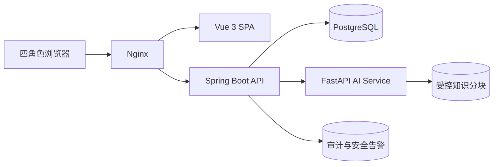

# 系统架构说明

## 架构

Spring Boot 是业务事实唯一来源，负责身份、状态机、规则、审核、随访和审计；FastAPI 是受限计算服务，只返回结构化草案与引用，不能直接写业务状态。前端永不直连 AI 服务。

## 关键不变量

1. `最终紧急度 >= 规则紧急度`。
2. AI 输出必须符合 schema、包含教学免责声明，关键理由必须引用已登记分块。
3. 只有医务人员可审核和激活计划；只有随访人员可执行任务。
4. AI 失败、超时或阻断后仍进入人工队列。
5. 所有病例都是合成数据，生产密钥和真实医疗数据不进入仓库。

## 模块

- 后端：`auth`、`visit/triage`、`followup`、`admin/audit`、`ai adapter`。
- AI：`schemas`、`providers`、`guardrails`、`retrieval`、`workflow`、`evaluation`。
- 前端：认证会话、角色路由、患者、医务、随访和管理工作台。

