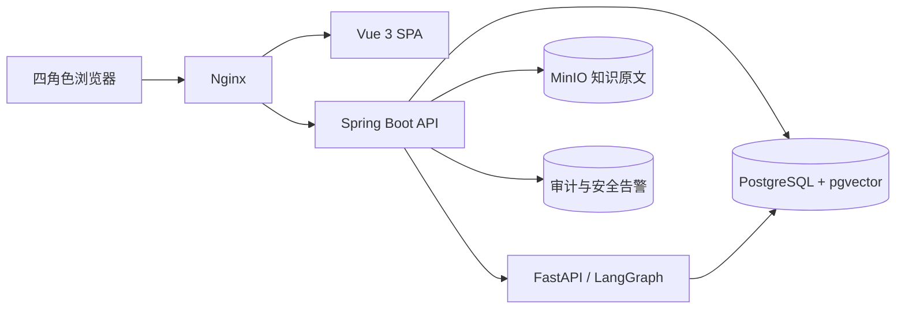

# 系统架构说明

Spring Boot 是业务事实唯一来源，负责 JWT、角色、问诊状态、目录、事实型规则、资料快照、人工审核、随访和审计。FastAPI 只返回摘要、遗漏问题、引用和安全决定，不能直接写业务状态。前端不直连 AI 服务。

## 关键不变量

1. 新问诊只能通过 `/api/v2` 写入，且不写数字严重度。
2. 规则紧急度允许为空；为空表示没有可用确定性自动等级，必须人工复核。
3. AI 不得降低已有规则等级，也不得为无规则症状生成紧急度。
4. 引用必须属于当前激活知识版本；检索证据不改变规则覆盖状态。
5. AI 失败、超时、无证据或被阻断时，问诊仍进入人工队列。
6. 只有医务人员能终审和激活随访，只有随访人员能执行任务。
