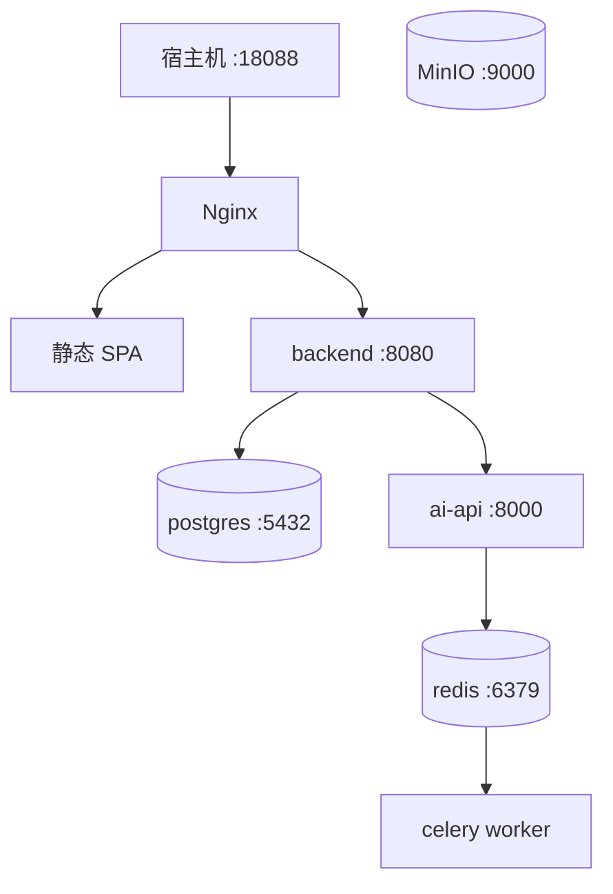

# 部署说明

开发模式可分别启动 Vue、Spring Boot 和 FastAPI，但数据库始终使用 PostgreSQL。Compose 模式由 Nginx 提供单入口，AI 服务仅暴露在内部网络。当前 Windows 开发机复用位于 H 盘的 `HermesUbuntu` WSL2 Docker Engine。

启动：复制 `.env.example` 为 `.env`，然后在 PowerShell 执行 `wsl -d HermesUbuntu -- bash -lc 'cd "/mnt/d/工程实训/final" && docker compose up --build -d --wait'`。Windows 路径进入 WSL 后统一使用 `/mnt/d/...` 和正斜杠，含中文的项目目录整体加引号。容器均配置健康检查；固定镜像标签，不使用 `latest`。
