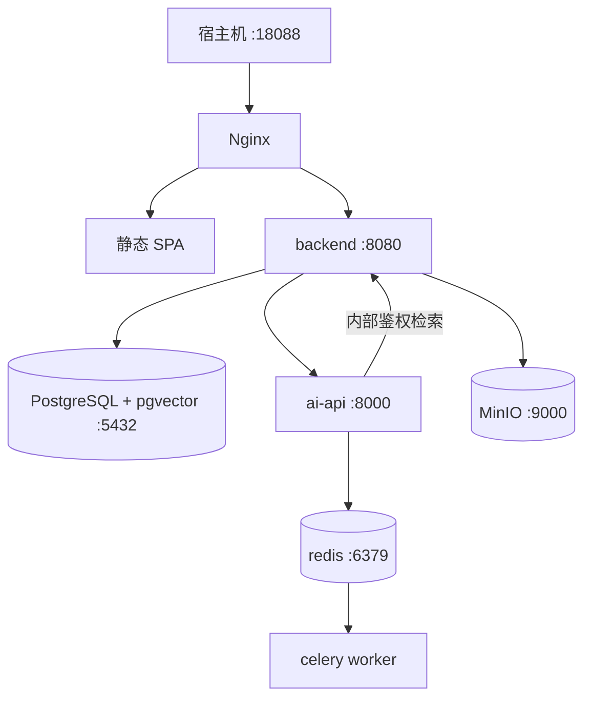

# 部署说明

开发模式可分别启动 Vue、Spring Boot 和 FastAPI，但数据库始终使用 PostgreSQL。Compose 模式由 Nginx 提供单入口，AI 服务仅暴露在内部网络。当前 Windows 开发机复用位于 H 盘的 `HermesUbuntu` WSL2 Docker Engine。

启动：复制 `.env.example` 为 `.env`，然后在 PowerShell 执行 `wsl -d HermesUbuntu -- bash -lc 'cd "/mnt/d/工程实训/final" && docker compose up --build -d --wait --remove-orphans'`。Windows 路径进入 WSL 后统一使用 `/mnt/d/...` 和正斜杠，含中文的项目目录整体加引号。MinIO bucket 由后端在启动时幂等创建，不再依赖一次性初始化容器；容器均配置健康检查，固定镜像标签，不使用 `latest`。

当前构建与运行链路不依赖 LibreOffice。若后续生成答辩文档需要调用 LibreOffice，Windows 进程只传 `D:\工程实训\final\...` 形式的反斜杠路径；WSL/Linux 进程只传 `/mnt/d/工程实训/final/...` 形式的正斜杠路径。不要把 `D:\...` 直接传给 WSL 内的 LibreOffice，也不要把 `/mnt/d/...` 直接传给 Windows 版 LibreOffice。
