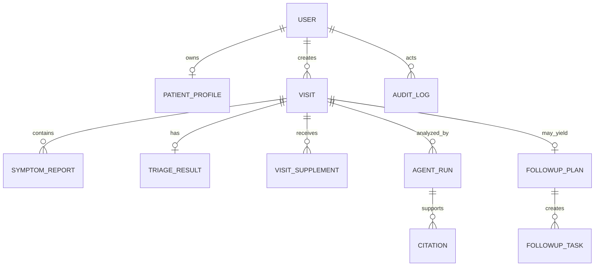

# 核心 ER 图

```mermaid
erDiagram
  USER ||--o| PATIENT_PROFILE : owns
  USER ||--o{ VISIT : creates
  VISIT ||--o{ SYMPTOM_REPORT : contains
  VISIT ||--o| TRIAGE_RESULT : has
  VISIT ||--o{ VISIT_SUPPLEMENT : receives
  VISIT ||--o{ AGENT_RUN : analyzed_by
  AGENT_RUN ||--o{ CITATION : supports
  VISIT ||--o| FOLLOWUP_PLAN : may_yield
  FOLLOWUP_PLAN ||--o{ FOLLOWUP_TASK : creates
  USER ||--o{ AUDIT_LOG : acts
```

V4 增加患者资料、资料快照、补充信息、事实型症状字段、覆盖状态和可空规则等级。历史数字列仅以 `legacy_severity` 只读保留。
