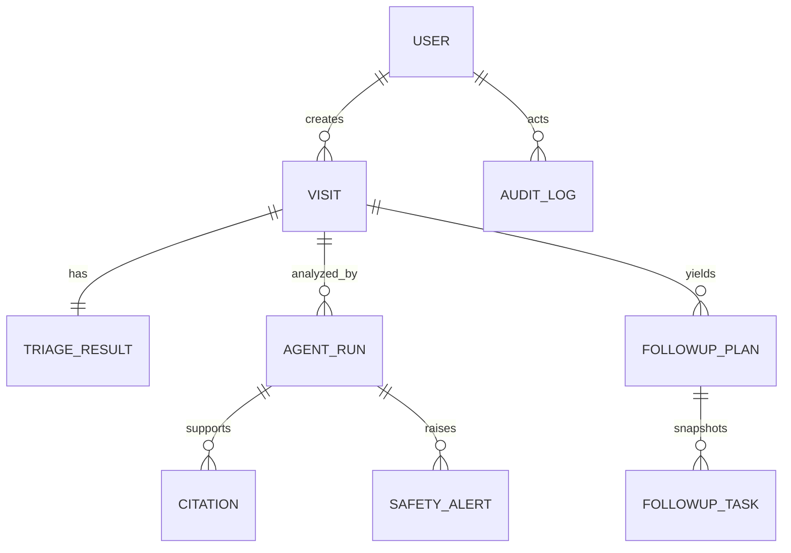

# 核心 ER 图

```mermaid
erDiagram
  USER ||--o{ VISIT : creates
  VISIT ||--|| TRIAGE_RESULT : has
  VISIT ||--o{ AGENT_RUN : analyzed_by
  AGENT_RUN ||--o{ CITATION : supports
  VISIT ||--o{ FOLLOWUP_PLAN : yields
  FOLLOWUP_PLAN ||--o{ FOLLOWUP_TASK : snapshots
  USER ||--o{ AUDIT_LOG : acts
  AGENT_RUN ||--o{ SAFETY_ALERT : raises
```

完整 DDL 位于 `backend/src/main/resources/db/migration/V1__baseline.sql`。主键使用 UUID 字符串，业务聚合包含乐观锁版本；用户、运行 ID 和幂等键具有唯一约束。

