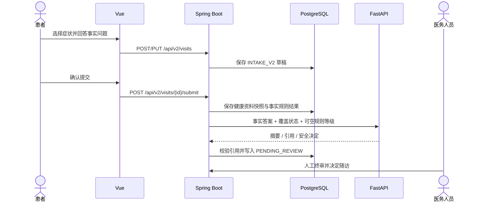

# 关键时序

```mermaid
sequenceDiagram
  actor P as 患者
  participant FE as Vue
  participant BE as Spring Boot
  participant DB as PostgreSQL
  participant AI as FastAPI
  actor C as 医务人员
  P->>FE: 选择症状并回答事实问题
  FE->>BE: POST/PUT /api/v2/visits
  BE->>DB: 保存 INTAKE_V2 草稿
  P->>FE: 确认提交
  FE->>BE: POST /api/v2/visits/{id}/submit
  BE->>DB: 保存健康资料快照与事实规则结果
  BE->>AI: 事实答案 + 覆盖状态 + 可空规则等级
  AI-->>BE: 摘要 / 引用 / 安全决定
  BE->>DB: 校验引用并写入 PENDING_REVIEW
  C->>BE: 人工终审并决定随访
```

无规则、AI 失败或无证据都不会生成安全结论；记录保持 `REQUIRES_MANUAL_REVIEW`。
