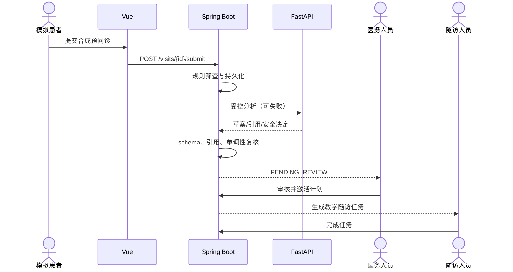

# 关键时序

```mermaid
sequenceDiagram
  actor P as 模拟患者
  participant FE as Vue
  participant BE as Spring Boot
  participant AI as FastAPI
  actor C as 医务人员
  actor S as 随访人员
  P->>FE: 提交合成预问诊
  FE->>BE: POST /visits/{id}/submit
  BE->>BE: 规则筛查与持久化
  BE->>AI: 受控分析（可失败）
  AI-->>BE: 草案/引用/安全决定
  BE->>BE: schema、引用、单调性复核
  BE-->>C: PENDING_REVIEW
  C->>BE: 审核并激活计划
  BE-->>S: 生成教学随访任务
  S->>BE: 完成任务
```

AI 超时或不可用时，后端记录 `FAILED` 运行并保留规则结果，病例仍进入 `PENDING_REVIEW`，不伪造成功结果。

