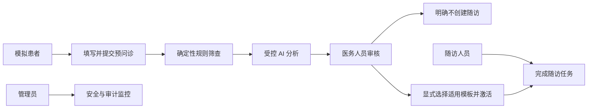

# 软件需求规格说明书（SRS）

## 1. 目标与边界

本系统是有限范围的基层医疗流程教学模拟平台，只使用合成病例和合规公开指南。当前自动规则只覆盖胸痛、呼吸困难、晕厥和意识异常 4 类结构化症状。系统不得输出确定诊断、处方或剂量，不得替代医务人员；目录外症状不得显示为已完成自动安全评估，规则结果不能被 AI 降级，AI 结果未经人工审核不能成为最终结果。

## 2. 角色与用户故事

- 模拟患者：从中文受控目录创建合成预问诊、分步保存和提交，并查看自己的随访任务；不维护内部症状代码。
- 医务人员：查看规则与 AI 草案、核对引用、接受/修改/拒绝，再独立选择“不创建随访”或适用模板。
- 随访人员：按最小必要信息执行、完成或标记随访任务。
- 管理员：查看用户、版本、Agent 运行、安全告警和不可变审计。

## 3. 功能需求

| ID | 需求 | 验收证据 |
|---|---|---|
| AUTH-01 | 登录签发 JWT，后端执行 RBAC | 后端鉴权/403 测试 |
| VISIT-01 | 患者通过 4 项中文受控症状目录创建、编辑并提交预问诊；默认空表单，内部代码不可编辑 | API + 前端表单测试 |
| RULE-01 | 红旗规则确定性筛查，取最高紧急度 | 黄金规则测试 |
| AI-01 | 受控 AI 返回结构化摘要、紧急度、引用与安全决定 | Pytest 与运行详情 |
| SAFE-01 | 攻击、越权诊断、无效引用被阻断或转人工 | 对抗测试与告警 |
| REVIEW-01 | 医务人员必须记录审核决定与理由 | 审核 API 与审计 |
| FOLLOW-01 | 审核后默认不创建计划；高血压模板只对明确适用病例显式创建，激活后原子生成任务 | 状态机测试与界面 |
| UX-01 | 长列表具备搜索/筛选/分页，移动端可完成核心流程，动态区域与操作具备可访问名称 | 1440×1000、390×844 浏览器回归 |
| AUDIT-01 | 关键动作追加审计，禁止前端修改历史 | 管理端审计页 |

## 4. 非功能需求

- 普通教学负载接口目标 p95 < 500 ms；AI 状态查询目标 < 300 ms。
- 服务提供健康检查；AI 故障时规则和人工审核仍可使用。
- 密钥仅从环境变量注入；日志不记录密码、token、完整自由文本或模型原始 Prompt。
- 桌面端与 390px 级移动视口适配，风险同时使用文字、图标和颜色表达；`NO_CONFIGURED_RED_FLAG` 必须说明仍需人工审核。

## 5. 用例关系

