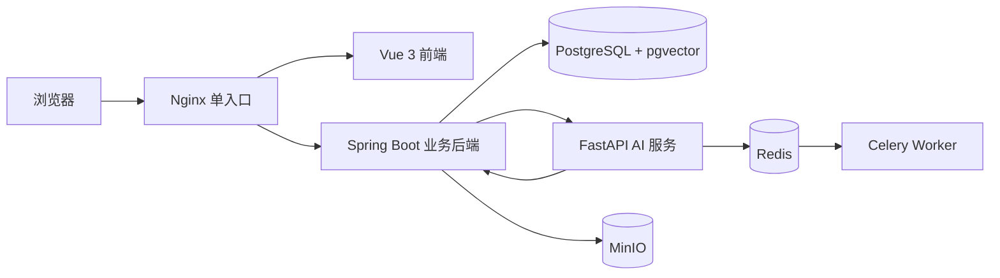

# 基层医疗安全型预问诊与随访平台——项目讲解与验收核对

> 核对日期：2026-07-24  
> 对照文件：`期末任务.docx`  
> 所选题目：选题二“基层医疗安全型预问诊与随访平台”

## 1. 验收结论

本项目已经完成选题二的主要业务功能、前后端分层、AI/RAG 安全链路、数据库迁移、容器化部署和大部分工程文档，具备继续完善后参加现场演示的基础。

但是，当前版本**不建议不加处理就直接作为最终作业提交**。原因不是需要重写或大规模优化代码，而是仍有以下几项与任务书“硬性要求”直接相关的交付缺口：

1. 远程 GitHub 仓库目前没有 Issue 和 Pull Request，只有分支、多人提交以及本地代码复核文档，尚未完整满足“Issue、分支、Pull Request、代码评审记录”的要求。
2. `docs/requirements/SRS.md` 已写角色、功能和非功能需求，但缺少明确的“用户故事”章节和“用例图”。
3. `docs/testing/TEST_REPORT.md` 仍写着“最终命令与结果在本轮完整回归后更新”，没有记录当前实际测试结果。

2026-07-24 的本轮修复已完成三项原有问题：冒烟脚本目录版本已同步；AI 作业等待上限已统一为 60 秒；OpenAPI 已补齐统一错误模型及常用错误响应。修复后完整 API 冒烟通过。

因此，更准确的结论是：

> **功能主体基本达到选题二要求；软件工程交付证据尚未全部达到硬性验收要求。完成上述补充与演示环境校准后，可以交付。**

## 2. 项目做了什么

项目实现了一个教学用途的基层医疗预问诊与随访平台。它帮助患者模拟用户整理不适信息，使用确定性规则识别有限的红旗组合，再由 AI 整理病情摘要、检索公开指南并给出可追溯引用，最终交给医务人员人工审核。审核通过后，医务人员可创建随访计划，随访人员执行任务，管理员查看知识来源、安全告警、Agent 运行和审计记录。

系统明确限定为教学辅助系统：

- 不提供真实诊断、处方或药物剂量；
- AI 不能替代医生终审；
- AI 不能降低确定性规则已经给出的紧急等级；
- 未被规则覆盖的症状不能自动判定为“常规”或“无风险”；
- 只使用合成病例和公开指南，不应保存未经授权的真实医疗数据。

## 3. 四类用户及其功能

| 角色 | 主要功能 | 项目实现 |
| --- | --- | --- |
| 患者模拟用户 | 填写预问诊资料、查看记录和随访任务 | 四阶段预问诊、草稿保存、健康资料、补充信息、记录与任务查看 |
| 医务人员 | 审核结构化病历和风险提示 | 待处理队列、患者原话与事实核对、规则/AI/RAG 分层展示、人工终审、随访决策 |
| 随访人员 | 管理和执行慢病/通用随访任务 | 查看已分配任务，按状态机推进并填写结果 |
| 管理员 | 管理指南、规则、模型和权限 | 查看指南来源、Agent 运行、安全告警和审计日志，执行知识索引重建与版本激活 |

系统预置了四个演示账号，密码均为 `Demo123!`：

- `patient`
- `clinician`
- `followup`
- `admin`

## 4. 完整业务流程


具体过程如下：

1. 患者选择症状并填写开始时间、变化过程、当前状态、活动影响和症状特异答案。
2. 后端在自由文本写库前进行隐私脱敏。
3. 规则引擎只判断任务书允许的有限红旗组合，例如胸痛并呼吸困难、意识异常等。
4. 对未覆盖症状，规则等级保持为空，状态明确进入人工复核，不生成虚假的“常规”结论。
5. AI 服务通过知识检索获取当前激活的公开指南分块，生成结构化摘要、追问项、风险信号、不确定性和引用。
6. 安全 Agent 检查提示词攻击、越权诊断、规则降级、无效引用和隐私泄露。
7. 后端再次校验引用和规则单调性，将结果写入医务人员待审队列。
8. 医务人员人工确认最终等级，并明确决定是否创建随访计划。
9. 随访人员推进任务状态并记录结果，管理员可查看完整审计链路。

## 5. 系统是怎么做的

### 5.1 总体架构



项目采用“Spring Boot 业务后端 + Python AI 服务”的分层方式：

- Spring Boot 是业务事实的唯一写入入口，负责身份、权限、状态机、规则、人工审核、随访和审计。
- FastAPI 负责 AI 工作流，不直接修改业务状态。
- PostgreSQL 保存业务数据，pgvector 保存知识向量。
- MinIO 保存指南原文等对象。
- Redis 和 Celery 负责异步 AI 作业。
- Nginx 对外提供统一入口，AI 服务不直接暴露给浏览器。

### 5.2 前端

前端位于 `frontend/`，使用 Vue 3、TypeScript、Vite、Pinia、Element Plus 和 ECharts。

主要页面包括：

- `PatientView.vue`：四阶段预问诊、问诊记录、随访任务和健康资料；
- `ClinicianView.vue`：待审队列、事实/规则/AI/引用分层核对、人工终审和随访决策；
- `FollowupView.vue`：随访任务状态推进和结果填写；
- `AdminView.vue`：Agent 运行统计、安全告警、知识来源和审计时间线；
- `LoginView.vue`：四角色演示入口。

前端通过角色路由限制不同工作区，并对窄屏、键盘焦点和危险提示做了相应处理。

### 5.3 Java 业务后端

后端位于 `backend/`，使用 Spring Boot、Spring Security、JPA、Flyway 和 PostgreSQL。

核心实现包括：

- JWT 登录和基于角色的接口授权；
- 患者数据所有权检查；
- 问诊和随访状态机；
- 红旗症状确定性规则；
- 医务人员人工审核；
- 随访计划创建、激活和任务分配；
- 敏感自由文本脱敏；
- Agent 运行、引用、安全告警和审计记录持久化；
- Flyway V1 至 V11 数据库迁移，其中 V11 清理旧自动化记录遗留的问号乱码；
- pgvector 知识检索与 MinIO 原文管理。

关键业务写操作使用 Spring `@Transactional` 管理事务。

### 5.4 Python AI、RAG 与多 Agent

AI 服务位于 `ai-service/`，使用 FastAPI、LangGraph、Celery 和 Pydantic。

当前工作流包含以下可观察职责：

1. 病例信息整理；
2. 知识证据检索；
3. 风险复核；
4. 引用校验；
5. 安全与输出范围检查。

AI 输出必须通过结构校验、规则单调性检查和引用白名单校验。真实模型不可用、超时或输出越界时，系统保留规则结果并转人工审核。

知识语料由 `data-pipeline/` 负责治理，来源限定为 WHO、CDC、NIH/NHLBI、NHS 等公开站点。项目保存 URL、抓取时间、哈希、版本和对象键，运行时后端和 AI 服务不临时抓取互联网内容。

### 5.5 数据库

数据库使用 PostgreSQL 16 和 pgvector。任务书要求的核心实体均已有实现，个别名称采用了等价命名：

| 任务书实体 | 项目表 |
| --- | --- |
| users | `users` |
| simulated_patients | `patient_profiles` |
| visits | `visits` |
| symptoms | `symptoms` |
| triage_results | `triage_results` |
| medical_guidelines | `guidelines`、`guideline_versions`、`guideline_chunks` |
| followup_plans | `followup_plans` |
| followup_tasks | `followup_tasks` |
| safety_alerts | `safety_alerts` |
| agent_runs | `agent_runs` |
| citations | `citations` |
| audit_logs | `audit_logs` |

数据库脚本中包含主键、外键、唯一约束、检查约束、普通索引、HNSW 向量索引和版本迁移。

## 6. 对照选题二功能要求

| 要求 | 核对结果 | 主要证据 |
| --- | --- | --- |
| 教学辅助定位，不替代医生 | 已满足 | README、SRS、前端提示、安全策略 |
| 四类用户角色 | 已满足 | 后端角色枚举、预置账号、四个角色页面 |
| 分步骤预问诊表单 | 已满足 | 患者端四阶段流程 |
| 医务工作台和待处理队列 | 已满足 | 医务端队列与审核工作流 |
| 症状时间线、风险等级和依据 | 已满足 | 事实答案、规则覆盖、AI 分层结果和引用 |
| 指南检索及原文对照 | 已满足 | pgvector 检索、引用抽屉、公开来源链接 |
| 随访计划、提醒和完成管理 | 已满足 | 计划激活、四项任务、状态推进 |
| 高风险案例和 AI 安全监控 | 已满足 | 管理员告警、运行统计、Agent 轨迹 |
| 就诊和随访状态机 | 已满足 | 问诊与任务状态枚举及后端校验 |
| JWT、RBAC、敏感字段脱敏 | 已满足 | Spring Security、角色注解、PrivacySanitizer |
| 红旗症状和禁忌规则 | 已满足 | RuleEngine 及相关测试 |
| AI 先安全复核再进入人工队列 | 已满足 | LangGraph 安全链路、后端二次校验 |
| 保存模型、Prompt、知识库版本和引用 | 已满足 | `agent_runs`、`citations` 等表 |
| 拦截越权诊断、提示词攻击和隐私泄露 | 已满足 | guardrails、安全告警和降级路径 |
| 只用合成病例和公开指南 | 已满足项目设计要求 | 演示夹具、官方语料白名单和合规文档 |
| 完整业务闭环 | 已满足 | 端到端冒烟已通过，包含 AI、引用、人工审核、随访和审计 |

## 7. 软件工程硬性要求核对

| 硬性要求 | 状态 | 说明 |
| --- | --- | --- |
| 需求规格说明书 | 部分满足 | 已有角色、功能和非功能需求；缺明确用户故事与用例图 |
| 系统设计说明书 | 满足 | 已有架构图、ER 图、时序图和部署图 |
| 前后端接口文档 | 满足 | 有 OpenAPI 3.1、版本、参数、JWT、统一错误模型及常用错误响应 |
| 数据库设计 | 基本满足 | 有约束、索引、迁移和事务实现；数据库说明可再补充事务边界 |
| Git 协作记录 | 未完全满足 | 有分支、多人提交和代码复核文档；远程无 Issue、无 Pull Request |
| 测试报告 | 部分满足 | 自动化测试和端到端冒烟均通过，但 `TEST_REPORT.md` 尚未写入本轮最终结果 |
| Docker Compose 一键启动 | 满足 | 配置校验通过，当前 7 个服务均为 healthy |
| 现场端到端演示 | 满足 | 当前真实 AI 环境下完整冒烟通过，AI、RAG、审核和随访链路均成功 |

## 8. 本轮实际验证结果

以下结果为 2026-07-24 在当前工作区和本机环境中实际执行所得：

| 项目 | 结果 |
| --- | --- |
| 前端 Vitest | 6 个测试文件、18 项测试全部通过 |
| 前端生产构建 | 通过 |
| Java/JUnit | 19 项测试全部通过，Maven `BUILD SUCCESS` |
| PostgreSQL/Flyway 集成 | PostgreSQL 16.10，10 个迁移校验通过 |
| Python/数据管道 Pytest | 21 项测试全部通过 |
| AI 服务覆盖率 | 87.23%，高于 75% 门槛 |
| 固定 AI 评测集 | 60 个案例，报告记录失败案例数为 0 |
| 性能冒烟 | 50 请求、并发 10、失败 0、P95 27 ms，门槛 500 ms |
| Compose | 配置合法，7 个服务均为 healthy |
| API 端到端冒烟 | 通过：AI `SUCCEEDED`、6 条引用、5 步 Agent 轨迹，随访任务完成 |
| 错误响应契约 | OpenAPI 18 个操作、129 个引用解析通过；实际 400/401 响应与统一错误模型一致 |

单元、集成、构建、数据库、性能和端到端冒烟均已通过，说明项目主体和现场演示链路可运行。当前不能直接描述为“所有硬性交付项均已满足”的原因，已收敛为 GitHub Issue/PR、SRS 用户故事与用例图、测试报告更新三项文档和协作证据问题。

## 9. 如何运行

项目建议在 WSL2 的 `HermesUbuntu` 中使用 Docker Compose 启动。

首次运行时先根据 `.env.example` 准备 `.env`，再执行：

```powershell
wsl -d HermesUbuntu -- bash -lc 'cd "/mnt/d/工程实训/final" && docker compose up --build -d --wait --remove-orphans'
```

浏览器打开：

```text
http://localhost:18088
```

查看容器状态：

```powershell
wsl -d HermesUbuntu -- bash -lc 'cd "/mnt/d/工程实训/final" && docker compose ps'
```

演示前应确保以下配置一致：

- 离线稳定演示使用 `AI_PROVIDER=fake` 和 `AI_MODEL=fake-v1`；
- 若演示真实兼容模型，当前默认 `AI_JOB_TIMEOUT_SECONDS=60`；仍应保证该值大于模型请求可能消耗的时间；
- 不要提交 `.env` 或真实 API Key；
- Windows 路径使用 `D:\...`，WSL 路径使用 `/mnt/d/...`，不要混用两种路径格式。

## 10. 建议的现场演示顺序

1. 使用 `patient` 登录，展示四个患者功能区。
2. 提交“头痛”案例，说明未覆盖症状不会自动得到“常规”结论。
3. 提交“胸口不适并呼吸困难”案例，展示红旗规则和优先人工审核。
4. 使用 `clinician` 登录，展示患者原话、事实答案、规则、AI 摘要和公开引用。
5. 完成人工终审，明确选择并激活通用随访计划。
6. 使用 `followup` 登录，将任务从待执行推进到已完成。
7. 使用 `admin` 登录，查看知识来源、Agent 运行、安全告警和审计时间线。
8. 如需展示降级能力，可停止或禁用 AI，再提交一条记录，说明系统仍会进入人工队列。

## 11. 交付前最小处理清单

以下操作完成后再提交，风险最低：

- [ ] 在 GitHub 创建并保留至少一个真实 Issue。
- [ ] 通过成员分支提交并创建 Pull Request，保留评审/合并记录。
- [ ] 在 SRS 中补充用户故事和用例图。
- [x] 补齐 OpenAPI 公共错误码和统一错误结构。
- [ ] 更新 `TEST_REPORT.md`，写入本轮实际命令、通过数量和性能结果。
- [x] 同步 `api-smoke.ps1` 中的目录版本断言。
- [x] 统一真实模型请求超时和后端作业等待超时。
- [x] 重新执行完整 API 冒烟，确认从患者提交到随访完成全程为 `PASS`。
- [ ] 答辩前按四个账号完整走一遍现场演示流程。

## 12. 项目主要资料入口

- 项目入口：`README.md`
- 文档索引：`docs/README.md`
- 需求说明：`docs/requirements/SRS.md`
- 系统架构：`docs/architecture/ARCHITECTURE.md`
- ER 图：`docs/architecture/ERD.md`
- 时序图：`docs/architecture/SEQUENCES.md`
- 部署图：`docs/architecture/DEPLOYMENT.md`
- OpenAPI：`docs/api/openapi.yaml`
- 数据库设计：`docs/database/DATABASE_DESIGN.md`
- RAG 实现：`docs/ai/RAG_IMPLEMENTATION.md`
- AI 评测：`docs/ai/AI_EVALUATION_REPORT.md`
- 安全合规：`docs/security/SECURITY_AND_COMPLIANCE.md`
- 测试报告：`docs/testing/TEST_REPORT.md`
- 演示脚本：`docs/demo/DEMO_SCRIPT.md`
- Docker Compose：`compose.yaml`
